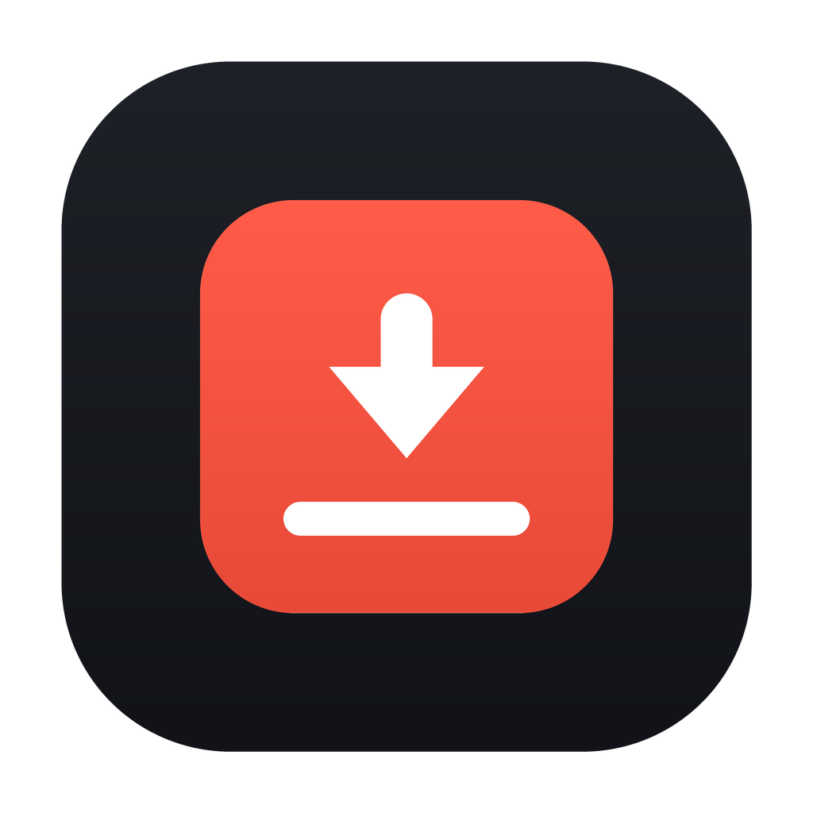

# Video Downloader

<p align="center">
  
</p>

<p align="center">
  <strong>High-Performance Desktop Media Downloader & Transcoder</strong><br>
  Built with <strong>Flet</strong> (Flutter-powered Native Desktop UI), <strong>yt-dlp</strong> (Universal Extraction Engine), and <strong>FFmpeg</strong> (Media Processing).
</p>

<p align="center">
  <a href="https://www.python.org/downloads/"></a>
  <a href="https://flet.dev"></a>
  <a href="https://github.com/yt-dlp/yt-dlp"></a>
  <a href="https://ffmpeg.org"></a>
  <a href="LICENSE"></a>
  <a href="https://github.com/astral-sh/uv"></a>
</p>

---

## Table of Contents

- [Overview](#overview)
- [Screenshots](#screenshots)
- [Key Features](#key-features)
  - [Download Modes & Formats](#download-modes--formats)
  - [Multi-Language Audio Dubs](#multi-language-audio-dubs)
  - [Embedded Subtitles & Captions](#embedded-subtitles--captions)
  - [Live File Size Estimation](#live-file-size-estimation)
  - [Playlist & Channel Batch Processing](#playlist--channel-batch-processing)
  - [Built-In Media Converter](#built-in-media-converter)
  - [Queue & Concurrency Management](#queue--concurrency-management)
  - [Privacy, Proxies & Authentication](#privacy-proxies--authentication)
- [Installation](#installation)
  - [Pre-Built Binaries](#1-pre-built-binaries)
  - [JavaScript Engine Setup (YouTube)](#2-javascript-engine-setup-youtube)
  - [FFmpeg Integration](#3-ffmpeg-integration)
- [Running from Source](#running-from-source)
- [Testing & Quality Assurance](#testing--quality-assurance)
- [Building & Packaging](#building--packaging)
  - [Local Desktop Builds](#local-desktop-builds)
  - [Automated Multi-Platform CI/CD](#automated-multi-platform-cicd)
- [Configuration & Settings](#configuration--settings)
- [Architecture & Design Principles](#architecture--design-principles)
- [Contributing](#contributing)
- [License](#license)

---

## Overview

**Video Downloader** is a modern, cross-platform desktop application designed to capture, organize, and convert video and audio from thousands of platforms (YouTube, Vimeo, Twitter/X, TikTok, Reddit, Instagram, Twitch, Dailymotion, Facebook, Bilibili, and many more). 

Unlike basic wrappers, Video Downloader features:
- A custom **Nocturnal Studio** design system with fluent dark/light modes and frameless window controls.
- Complete multi-track audio extraction and remuxing into universal Matroska (`.mkv`) containers.
- Lossless remuxing vs. transcode detection to prevent quality loss and ensure blazing fast performance.
- A fully asynchronous, thread-isolated architecture: download tasks run on dedicated background workers while events sync smoothly to the UI via an internal `EventBus`.

---

## Screenshots

### Main Window & URL Extraction
| Dark Mode | Light Mode |
| :---: | :---: |
|  |  |

### Download Configuration & Multi-Track Selection
| Single Video Configuration | Multi-Audio & Subtitle Picker |
| :---: | :---: |
|  |  |

### Format Explorer Table & Settings
| Format Explorer | Settings & Dependency Inspector |
| :---: | :---: |
|  |  |

---

## Key Features

### Download Modes & Formats
- **Video + Audio (`VIDEO_AUDIO`)**: Automatically downloads the highest quality video and audio streams, muxing them seamlessly via FFmpeg.
- **Audio Only (`AUDIO_ONLY`)**: Extracts audio directly with bitrate control (up to 320 kbps) and converts to `MP3`, `M4A`, `AAC`, `FLAC`, `OPUS`, or `WAV`.
- **Video Only (`VIDEO_ONLY`)**: Downloads video without audio tracks for background footage or silent assets.
- **Preset Resolutions**: 4320p (8K), 2160p (4K), 1440p (2K), 1080p (Full HD), 720p (HD), 480p (SD), 360p, 240p, 144p.
- **Frame Rate Filters**: Target 60 FPS, 30 FPS, or best available.
- **Containers**: MP4, MKV, WebM, AVI, MOV, TS.

### Multi-Language Audio Dubs
- **Multi-Track Selection**: Detects and exposes all audio dub tracks for multi-language videos (such as MrBeast videos with 20+ languages).
- **Three Audio Modes**:
  - **Default**: Downloads the creator's primary audio track.
  - **All Tracks**: Downloads and merges all available language dubs.
  - **Custom**: Checkbox list allowing you to select any combination of audio tracks (e.g. English + Spanish + German + Arabic).
- **Universal Playback & Tagging**:
  - Encodes multi-audio tracks into high-bitrate **192 kbps AAC** within Matroska (`.mkv`) containers.
  - Sets clean stream dispositions (`-disposition:a:0 default`, `-disposition:a:1 0`...) so media players (VLC, Windows Media Player, MPC-HC, TV players) switch cleanly without silence or packet header errors.
  - Injects human-readable track titles (e.g. `English`, `Arabic`, `German`, `Hindi`) and BCP-47 language metadata into container headers.

### Embedded Subtitles & Captions
- **Full Subtitle Support**: Detects both creator-uploaded subtitles and automatic speech-to-text captions.
- **Modes**: None, All Subtitles, or Custom selection (e.g. English, Spanish, French).
- **Direct Embedding**: Soft subtitles embedded directly into MKV/MP4 containers without hardcoding (burned-in) or separate sidecar `.srt` files.

### Live File Size Estimation
- **Real-Time Size Preview**: Displays an estimated file size widget directly beside the Download button.
- **Dynamic Updates**: Automatically recalculates when switching resolution, container, frame rate, audio tracks, or manual format streams.
- **Codec-Aware**: Uses actual stream payloads (`filesize` / `filesize_approx` / `tbr`) for precision.

### Playlist & Channel Batch Processing
- **Flat Playlist Analysis**: Rapidly extracts metadata for hundreds of playlist entries in seconds without freezing.
- **Interactive Selection**: Select all, unselect all, or cherry-pick specific videos from a playlist.
- **Smart Formatting**: Formats playlist items with structured naming: `Playlist Title/001 - Video Title.ext`.

### Built-In Media Converter
- **Lossless Stream Copy**: Converts between compatible containers (e.g., MP4 to MKV) in fractions of a second using `-c copy`.
- **Transcoding**: High-quality audio/video transcoding for incompatible formats.
- **Batch Processing**: Convert multiple local media files simultaneously.

### Queue & Concurrency Management
- **Concurrent Downloads**: Default concurrency set to **8** workers (customizable up to **16** in Settings).
- **Live Metrics**: Real-time progress percentage, downloaded bytes, total size, download speed, and estimated time of arrival (ETA).
- **Safe Task Cancellation**: Instant task cancellation with temporary file cleanup.

### Privacy, Proxies & Authentication
- **Browser Cookies**: Extract session cookies from Chrome, Edge, Firefox, Brave, Chromium, Opera, or Safari for age-restricted, private, or subscriber-only videos.
- **Proxy Support**: Full HTTP, HTTPS, and SOCKS5 proxy support.
- **Custom HTTP Headers**: Supply custom headers or user-agent strings for restricted servers.
- **Rate Limiting**: Limit download speed per task to avoid bandwidth saturation.

---

## Installation

### 1. Pre-Built Binaries

Download the Windows x64 package from the [Latest Releases](../../releases/latest):

| Operating System | Download File | Installation Instructions |
| :--- | :--- | :--- |
| **Windows (x64)** | `VideoDownloader-windows-x64-setup.exe` | Run the installer. If SmartScreen appears, click **More info -> Run anyway**. |
| **Windows (x64, zipped)** | `VideoDownloader-windows-x64-setup.zip` | Extract the zip, then run the setup `.exe` inside it. |

> Windows ARM64, macOS, and Linux release builds are currently disabled in CI.
> The local build commands below remain useful for development on those platforms.

---

### 2. JavaScript Engine Setup (YouTube)

YouTube requires solving JavaScript challenge signatures (n-sig / player challenges). Installing a lightweight JS runtime ensures 100% download reliability without throttling:

| Platform | Recommended Engine | Installation Command |
| :--- | :--- | :--- |
| **Windows** | [Deno](https://deno.land) or [Node.js](https://nodejs.org) | `winget install deno` or `winget install OpenJS.NodeJS` |
| **macOS** | [Deno](https://deno.land) | `brew install deno` |
| **Linux** | [Deno](https://deno.land) or Node.js | `sudo snap install deno` or `sudo apt install nodejs` |

*The app automatically detects Deno, Node.js, and Bun and shows live status in **Settings -> Dependencies**.*

---

### 3. FFmpeg Integration

The app automatically searches for FFmpeg in the following order:
1. **System `PATH`**: Custom or system-installed FFmpeg (`winget install ffmpeg`, `brew install ffmpeg`, `sudo apt install ffmpeg`).
2. **Downloaded Toolchain**: Downloadable directly through **Settings -> Download Full FFmpeg Toolchain** (`static-ffmpeg`).
3. **Bundled Fallback**: Built-in `imageio-ffmpeg` binary.

---

### 4. Startup Diagnostics

On Windows, the production app opens the native window immediately during startup. If the app cannot start, it shows a visible error message instead of failing silently. Fatal startup errors are written to:

```text
%LOCALAPPDATA%\Fazi Gondal\VideoDownloader\Logs\app.log
```

---

## Running from Source

We use [uv](https://docs.astral.sh/uv/) for blazing-fast, deterministic dependency management:

```bash
# 1. Clone the repository
git clone https://github.com/fazi-gondal/Video-Downloader.git
cd Video-Downloader

# 2. Install dependencies into virtual environment
uv sync

# 3. Activate the virtual environment:
# 🪟 PowerShell (Windows):
.venv\Scripts\Activate.ps1
# (Note: If PowerShell script execution is restricted, run once:
#  Set-ExecutionPolicy -ExecutionPolicy RemoteSigned -Scope CurrentUser)

# 🪟 Command Prompt (Windows):
.venv\Scripts\activate.bat

# 🍎/🐧 macOS & Linux (Bash/Zsh):
source .venv/bin/activate

# 4. Launch the desktop application
python main.py

# Or run directly via uv without manually activating:
uv run python main.py

# (Optional) Run in web development mode
uv run flet run --web main.py
```

---

## Testing & Quality Assurance

Run the automated test suite and code quality checkers:

```bash
# Run unit and integration tests (90 tests)
uv run pytest

# Check code style with Ruff
uv run ruff check .

# Validate strict type hints with mypy
uv run mypy video_downloader
```

---

## Building & Packaging

### Local Desktop Builds

Compile native executables for your current operating system using `flet build`:

```bash
# Windows -> build/windows/
uv run flet build windows --yes

# macOS -> build/macos/Video Downloader.app
uv run flet build macos --yes

# Linux -> build/linux/
uv run flet build linux --yes
```

> **Build Prerequisites**:
> - **Windows**: Visual Studio Build Tools with the *Desktop development with C++* workload.
> - **Linux**: `sudo apt-get install ninja-build libgtk-3-dev libmpv-dev mpv`
> - **macOS**: Xcode or Xcode Command Line Tools (`xcode-select --install`).

---

### Automated Release CI/CD

The workflow in [`.github/workflows/build.yml`](.github/workflows/build.yml) builds the Windows x64 release package on every `v*` tag. The release uploads both the setup installer and a maximum-compression zip containing the same setup `.exe`:

- `VideoDownloader-windows-x64-setup.exe`
- `VideoDownloader-windows-x64-setup.zip`

Windows ARM64, macOS, and Linux matrix entries are kept commented out in the workflow and can be re-enabled later.

```bash
# Create and push a version tag
git tag v1.0.0
git push origin v1.0.0
```

---

## Configuration & Settings

Settings are stored in JSON format inside the OS user application directory:
- **Windows**: `%LOCALAPPDATA%\VideoDownloader\settings.json`
- **macOS**: `~/Library/Application Support/VideoDownloader/settings.json`
- **Linux**: `~/.config/VideoDownloader/settings.json`

| Setting | Type | Default | Description |
| :--- | :--- | :--- | :--- |
| `download_dir` | `str` | `~/Downloads/VideoDownloader` | Output destination directory. |
| `max_concurrent` | `int` | `8` | Number of simultaneous download threads (1-16). |
| `proxy` | `str` | `""` | Optional proxy URL (`http://...`, `socks5://...`). |
| `cookies_browser` | `str` | `""` | Browser to extract session cookies from, or empty for disabled. |
| `custom_headers` | `dict[str, str]` | `{}` | Extra HTTP headers for restricted servers. |
| `rate_limit_kbps` | `int` | `0` | Speed cap per download task in KB/s; `0` means unlimited. |
| `keep_originals` | `bool` | `True` | Keep source files after conversion or merging. |
| `write_subtitles` | `bool` | `False` | Automatically download and embed subtitles. |
| `subtitle_langs` | `list[str]` | `["all"]` | Subtitle languages to request. |
| `multi_audio` | `bool` | `False` | Preserve multiple audio tracks when available. |
| `embed_thumbnail` | `bool` | `True` | Embed thumbnail as cover art in output file. |
| `embed_metadata` | `bool` | `True` | Embed title, artist, description, and chapters. |
| `prefer_vp9_video` | `bool` | `True` | Prefer modern VP9/WebM video streams when available. |
| `theme_mode` | `str` | `"system"` | UI theme: `"system"`, `"dark"`, or `"light"`. |

---

## Architecture & Design Principles

```text
video_downloader/
|-- config/             # Constants, quality presets, settings model, and persistence
|-- core/               # Error taxonomy, event bus, typed events, and logging
|-- models/             # MediaInfo, FormatInfo, PlaylistInfo, DownloadTask, ConversionTask
|-- services/           # YtDlpService, FFmpegService, FormatBuilder, DownloadManager, HistoryService
|-- ui/
|   |-- components/     # Reusable UI widgets (ChipGroup, FormatTable, FolderPicker, Cards)
|   |-- views/          # Main views: DashboardView, ConfigView, DownloadsView, ConverterView, SettingsView
|   |-- theme.py        # Nocturnal Studio design tokens, typography, and palette
|   `-- app.py          # AppShell, window chrome, navigation state, and lifecycle
`-- utils/              # Human formatting, path sanitization, and URL validators
```

### Key Design Tenets:
1. **Thread Isolation**: `yt-dlp` and `FFmpeg` execute inside background worker pools. UI components are never accessed from worker threads.
2. **EventBus Communication**: State updates, progress metrics, and errors publish through `core.events` to keep the UI silky-smooth and responsive.
3. **Pure Format Specifications**: `format_builder.py` is a pure functional compiler converting user UI selections into deterministic `yt-dlp` CLI and Python options.
4. **Surgical Process Management**: FFmpeg merges stream pipes via `subprocess.Popen` with buffer-drain protection to avoid OS deadlock on large multi-track remuxes.

---

## Contributing

Contributions, bug reports, and feature suggestions are welcome!
1. Fork the repository.
2. Create a feature branch: `git checkout -b feature/amazing-feature`.
3. Commit your changes: `git commit -m 'feat: add amazing feature'`.
4. Run tests: `uv run pytest && uv run ruff check .`.
5. Push to the branch: `git push origin feature/amazing-feature`.
6. Open a Pull Request.


## Credits

This project is based on the original [Video-Downloader by Wachu985](https://github.com/Wachu985/Video-Downloader) and has been customized and extended in this repository.

---

## License

Distributed under the **MIT License**. See [`LICENSE`](LICENSE) for more information.

<p align="center">
  Crafted with care by <strong>Fazi Gondal</strong>
</p>
